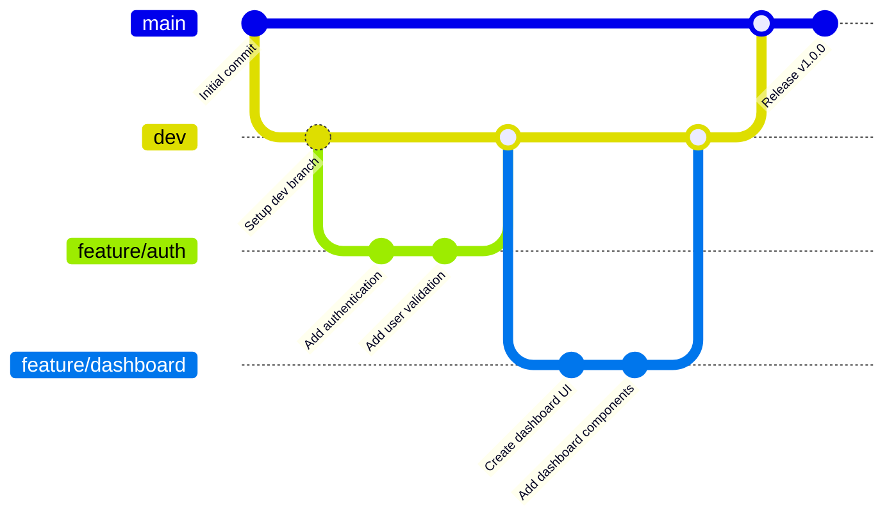

# EventHub

Events manager application

# Conventional Commits

Conventional Commits is a specification for adding human- and machine-readable meaning to commit messages.

## Commit Types

- **feat:** A new feature for the codebase (correlates with MINOR in Semantic Versioning).
- **fix:** A bug fix for the codebase (correlates with PATCH in Semantic Versioning).
- **BREAKING CHANGE:** Introduces a breaking API change. This can appear in any commit type and is indicated either by:
  - A `BREAKING CHANGE:` footer in the commit message, or
  - An exclamation mark after the type/scope, e.g., `feat!: ...`.
- **Other types:** Allowed types include:
  - `build:` – Changes that affect the build system or external dependencies.
  - `chore:` – Routine tasks and maintenance.
  - `ci:` – Continuous integration configuration.
  - `docs:` – Documentation only changes.
  - `style:` – Code style changes (formatting, missing semicolons, etc.).
  - `refactor:` – Code changes that neither fix a bug nor add a feature.
  - `perf:` – A code change that improves performance.
  - `test:` – Adding or correcting tests.

# Git workflow minimal

- main : contains stable code, used for production.
- dev : serves to gather developments before merging them into main.
- feature/\* : temporary working branches for a specific task or feature.

## Schéma du workflow Git



## Règles du workflow

### Branches protégées

- **main** : Branche de production, code stable uniquement
- **dev** : Branche d'intégration pour regrouper les développements

### Branches éphémères

- **feature/\*** : Branches de développement pour nouvelles fonctionnalités
- **hotfix/\*** : Branches pour corrections urgentes en production

### Processus de développement

1. **Création d'une feature** :

   ```bash
   git checkout dev
   git pull origin dev
   git checkout -b feature/nom-de-la-fonctionnalite
   ```

2. **Développement** :

   - Commits réguliers avec messages conventionnels
   - Push de la branche feature

3. **Intégration** :

   - Pull Request vers `dev`
   - Review du code
   - Merge après validation

4. **Release** :
   - Pull Request de `dev` vers `main`
   - Tests de régression
   - Merge et tag de version

### Règles de protection

- **main** : Push direct interdit, Pull Request obligatoire
- **dev** : Push direct interdit, Pull Request obligatoire
- Review obligatoire avant merge
- Tests automatiques requis avant merge
